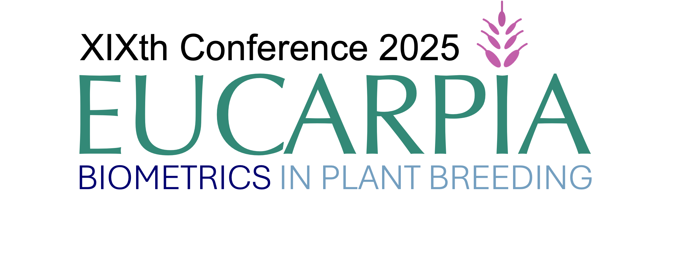

## 2025 Organisation Committee
## Financial support 
We are very grateful to our sponsors for financially supporting the meeting.

## Contact
For inquiries please send an email to eucarpia.biometrics19@gmail.com - thank you!